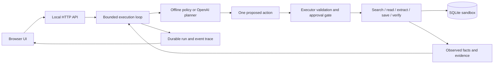

# Relay — autonomous invoice operations worker

**Give it an outcome. Inspect the execution. Verify the result.**

Relay takes a natural-language invoice task, chooses tools from observed state, reads source documents, writes a sandbox company ledger, and independently checks the saved values. It pauses for missing information or approval and leaves an exportable execution trace.

This is a deliberately narrow prototype, not a universal desktop agent. It uses **actual local tool execution and SQLite persistence** in a fictional company environment. There are two clearly labeled planners:

- **Offline demo:** a deterministic, observation-driven policy with limited natural-language parsing. No API key or runtime dependencies. This mode is **not an LLM**.
- **OpenAI mode:** an optional Responses API integration. A model interprets the goal and selects each next tool using the current memory and observations. It shares the same executor and checks. **Live model execution was not tested in the submission environment because no API credentials were available.** API request/response handling is covered by mocked contract tests; those tests do not establish live model reliability.


## Run locally

Requires Python **3.11+**. Tested on Python 3.13.14, Windows, and Chrome.

```sh
python app.py
```

Open **http://127.0.0.1:8000**. No install step, account, or API key is required for offline mode. The server binds to loopback only. It seeds five fictional invoice documents on first run and persists state in `data/relay.db`.

To use another port or a separate fresh sandbox:

```sh
python app.py --port 8001 --db data/another-demo.db
```

Click **Register latest invoice**, then **Run task**. Inspect the trace, open the original source, and check **Company ledger**. Run the task again to see duplicate protection. Use **Export** to download the full JSON trace, including evidence and recovery events.

### Optional model mode

Set a model identifier available to your OpenAI account that supports Responses function calling. There is deliberately no hard-coded model default. The model name appears in the UI; the executor and tools do not depend on a particular model.

PowerShell:

```powershell
$env:OPENAI_API_KEY = "your-api-key"
$env:OPENAI_MODEL = "your-supported-model-id"
python app.py
```

macOS / Linux:

```sh
export OPENAI_API_KEY="your-api-key"
export OPENAI_MODEL="your-supported-model-id"
python app.py
```

Select **OpenAI** in the composer. Both variables must be present when the server starts. `.env.example` documents the variables; the application does not automatically load `.env` files.

Only the model integration calls an external service. It sends the task, goal, sandbox document content, and execution observations to OpenAI. The key stays on the server and is never placed in the trace. Requests use `store: false`; this is not a promise about all provider retention policies. Model mode can incur API charges. Provider errors stop the task explicitly; there is no silent switch to the offline planner.

## Demo and source

- **[Watch the recorded demo](artifacts/relay-demo.webm)** — an unedited browser recording of actual execution, including a committed-write timeout, approval, clarification, archive fallback, and the resulting ledger. Download and open in Chrome, Edge, Firefox, or VLC if your repository viewer does not play WebM inline.
- **[Execution evidence from the recording](artifacts/demo-traces.json)** — the four persisted task traces.
- **[Demo walkthrough](docs/DEMO.md)** — steps and expected results.
- **Source:** this directory is the complete, self-contained submission. The packaged delivery also includes `artifacts/relay-source.zip` as an equivalent downloadable source archive. It excludes API keys, runtime databases, logs, and Python caches.
- **Local live demo:** http://127.0.0.1:8000 while the server runs. This is not a public deployment.

## Supported requests

| Request | Outcome |
| --- | --- |
| “Find the latest invoice from Acme Cloud and enter it in our ledger.” | Registers AC-2026-1001, USD 2,480.00, due 2026-10-31; reads it back. |
| “Register all invoices from Acme Cloud.” | Registers two invoices, totaling USD 4,320.00. |
| “Summarize all invoices from Acme Cloud, including amounts and due dates.” | Produces a source-backed report without ledger writes. |
| “Register the latest invoice from Company X.” | Uses the same engine for a different vendor; USD 975.50. |
| “Register the latest invoice from Northstar Labs.” | Pauses for a confirmed due date, then resumes the same run. |
| “Register the latest invoice from Orbit Studio.” | Pauses before recording USD 12,500.00; allows approval or denial. |
| “Register the latest invoice.” | Asks which company to use. |

Offline mode recognizes a company name, a register/summarize intent, and latest/all scope. It is not a general semantic parser. Use a full restatement when clarifying an unsupported request. Some unsupported qualifiers may escape the simple parser; do not use this mode for real business requests.

“Latest” means the greatest issue date in the sandbox index, with document ID as a stable tie-breaker. The fixture dataset is fixed in October 2026, independent of the machine clock. All money is USD, stored as integer cents. There are no payments, deletion tools, outgoing messages, or third-party company connections.

## Architecture



1. **Interpret:** produce a goal contract: vendor, operation, and latest/all scope. Ambiguous goals pause for input.
2. **Decide:** the planner proposes one tool, source reference, and short action rationale. The next decision depends on actual observations, not an advance-only script.
3. **Act:** the executor enforces selected-source scope, action ordering, read-only summary intent, source freshness, and exact-invoice approval. Tool arguments cannot contain shell commands or arbitrary paths.
4. **Observe and remember:** source text, parsed fields, saved record IDs, errors, approvals, and read-back evidence are checkpointed in SQLite.
5. **Recover or pause:** inbox failure selects an alternative archive index. A timeout after commit is reconciled through an idempotent save. Missing due dates and high-value records pause the same durable run.
6. **Verify:** a separate database read compares all eight invoice fields. `finish` independently rechecks source and ledger values and rejects premature or stale success claims.

The model's `take_action` function is a structured decision boundary. The application dispatches the selected domain tool locally and supplies its observation in the next request. Each request contains the current state rather than depending on provider-side conversation state. Free-form model text never becomes a completion receipt.

| File | Responsibility |
| --- | --- |
| `app.py` | HTTP endpoints, local-origin checks, static assets, server lifecycle |
| `worker/engine.py` | Execution loop, tool dispatch, parser, policy, recovery, verification |
| `worker/providers.py` | Interchangeable offline and OpenAI planners |
| `worker/store.py` | SQLite persistence, fixtures, invoice identity and transactional writes |
| `static/` | Responsive UI, polling, clarification/approval controls, source viewer |
| `tests/` | Executor, API, provider contract, and browser acceptance tests |

Read the [design notes](docs/ARCHITECTURE.md) for tradeoffs, failure semantics, and extension points.

## Reliability and verification

- **No invented missing dates:** missing values require explicit user input, which is recorded separately from source facts.
- **No duplicate records on retry:** `(vendor, invoice number)` is unique; writes use a SQLite transaction. Existing identical values are reused; conflicting values are never silently overwritten.
- **Approval bound to content:** invoices at or above USD 10,000 require approval of the exact validated invoice fingerprint. A later source change stops the write.
- **Bounded execution:** at most 36 tool decisions per run; retryable tool failures receive at most two retries after the initial attempt, except inbox recovery which selects the archive. Model requests have a 30-second network timeout and an output token cap.
- **Crash visibility:** startup marks formerly active runs interrupted. Explicit resume reconciles persisted writes. Pending approvals survive restart. Cancellation stops before the next tool; it does not roll back existing records.
- **Evidence-based completion:** all selected invoices must satisfy the goal. Completion is never inferred from a successful click or a model's assertion.
- **Controlled fault injection:** “Inbox unavailable” and “Timeout after save” exercise actual alternative-path and duplicate-reconciliation code. These faults are simulated; the subsequent reads and writes are real.

## Tests

```sh
python -m unittest discover -v
```

**39 tests passed** in the submission environment. They cover latest/all selection, different vendors, read-only summaries, missing data, approval and denial, changed sources, concurrent duplicate writes, post-commit timeout, archive fallback, bounded retries and steps, restart recovery, prompt-like source content, conflicting fields, invalid amounts, verification mismatch, premature completion, HTTP input/origin checks, and the model adapter's wire format.

Optional browser acceptance and demo regeneration:

```sh
python -m pip install -r requirements-dev.txt
python -m playwright install chromium ffmpeg
python -m tests.browser_demo
```

With Chrome already installed, use `python -m tests.browser_demo --channel chrome` after installing Playwright and its FFmpeg component. This starts its own temporary sandbox, checks the UI workflows at desktop and mobile widths, asserts no browser runtime errors or horizontal overflow, and writes screenshots, traces, and `artifacts/relay-demo.webm`. Browser tests do not modify the normal demo database.

## Assumptions and limitations

- Single local user, fictional documents, one server process. The loopback server is not a production web server and has no authentication or multi-tenant isolation. Do not expose it publicly without adding those controls.
- Only invoice registration and summaries, for four seeded vendors and latest/all scope. Neither planner can control arbitrary websites or desktop applications.
- Source documents are text in a known format, not PDFs or OCR. The inbox and archive are two adapters over the same fixture data. The worker operates through Python tools; browser interaction is the user's interface, not the worker's execution mechanism.
- Extraction is deterministic, including in model mode. This keeps source-to-ledger verification understandable but does not support varied invoice layouts.
- The model interprets intent, so a mistaken goal interpretation remains possible. Executor checks constrain tool effects but do not prove the goal perfectly represents arbitrary language. Offline parsing has narrower coverage still.
- The prompt marks retrieved text untrusted, and host checks limit effects. The included injection test establishes behavior only for the deterministic planner; it is not a comprehensive model prompt-injection evaluation.
- Successful verification is a point-in-time read, not a guarantee against subsequent external modification. No distributed transaction or rollback across a batch. Earlier completed writes remain if later work fails or is cancelled.
- State and trace live in one serialized run record; this is adequate for the prototype, not an append-only audit system. The UI/API list the 100 most recently updated runs. There is no data-retention UI.
- Model errors stop explicitly rather than automatically retrying paid model requests. Live model compatibility, costs, latency, and quality require evaluation with a real configured account.
- The UI polls every 700 ms. Four simultaneous newly submitted active runs are allowed as a local convenience, not a production-grade job queue or resource quota.

## What I would build next

1. Evaluate the model-driven planner on paraphrases, unsupported constraints, malicious documents, and ambiguous goals, measuring task success and false completion separately.
2. Replace fixture adapters with a sandbox mail API and invoice service; add provenance-preserving PDF extraction with confidence and line-level evidence.
3. Add a durable job queue, append-only events, transactional checkpoints, strict execution deadlines, and per-run token/cost budgets.
4. Show a user-reviewable goal contract for ambiguous/high-impact interpretations, plus more precise approval and capability policies.
5. Add authentication, per-user workspaces, secrets management, monitoring, deployment configuration, and a public demo restricted to disposable synthetic data.

## Components and attribution

- Python standard library: `http.server`, `sqlite3`, `urllib`, `decimal`, `threading`, `unittest`.
- Vanilla HTML, CSS, and JavaScript; no frontend framework, build step, CDN, or remote font dependency.
- Optional **OpenAI Responses API**, called via standard-library HTTPS with strict function schemas. API shape checked against the [official function-calling documentation](https://developers.openai.com/api/docs/guides/function-calling). No OpenAI SDK or agent framework is used. Model chosen by the operator through `OPENAI_MODEL`.
- **Playwright 1.63.0**, Chrome, and Playwright's FFmpeg binary for development-time browser verification and recording only; none required to run the app.
- AI coding assistance: OpenAI Codex was used to implement, test, document, and inspect the prototype. No real company credentials or confidential information were used.
